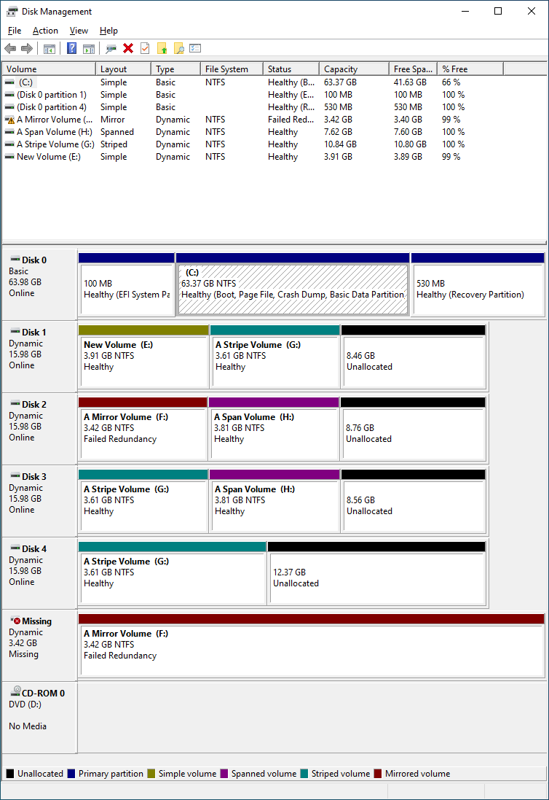

# poc-VdsVolumeList

Windows 上で[仮想ディスクサービス (Virtual Disk Service; VDS)](https://learn.microsoft.com/en-us/windows/win32/vds/virtual-disk-service-portal) を使ってボリュームの情報を一覧する PoC コード

これは PoC コードです。エラーチェックやクリーンアップ処理は書かれていません。このコードをそのままプロダクション環境に使用するべきではありません。

## 出力例

以下のような状況で、さらに "A Span Volume" は E:\mnt にもマウントされているとしましょう。



出力は以下のようになります。

```
C:\Users\umezawa\Downloads>VdsVolumeList.exe
id=a86ae501-ef73-4c8d-827e-98ba5046b05f name="Microsoft Virtual Disk Service Dynamic Provider" type=Software
  id=a2ba64ee-0ab7-456f-858c-10c9c065b2fa name="DESKTOP-GCMHVE2-Dg0" status=Online
    id=f4b94012-6bba-409c-a8ce-eca862ef6d2c name="\\?\GLOBALROOT\Device\HarddiskVolume12" type=Stripe status=Online health=Healthy fs=NTFS label="A Stripe Volume" path=G:\ flags=FatNotSupported,PermanentDismountSupported,RefsNotSupported
    id=78c4cc99-2654-42d4-9206-f2506b665b58 name="\\?\GLOBALROOT\Device\HarddiskVolume11" type=Simple status=Online health=Healthy fs=NTFS label="New Volume" path=E:\ flags=CanExtend,CanShrink,PermanentDismountSupported,RefsNotSupported
    id=758c515a-23cc-41eb-9ce8-e8c59111bcc3 name="\\?\GLOBALROOT\Device\HarddiskVolume10" type=Mirror status=Online health=FailedRedundancy fs=NTFS label="A Mirror Volume" path=F:\ flags=PermanentDismountSupported,RefsNotSupported
    id=8289cd44-4a7b-4be2-9c39-cde46352a47c name="\\?\GLOBALROOT\Device\HarddiskVolume9" type=Span status=Online health=Healthy fs=NTFS label="A Span Volume" path=H:\ path=E:\mnt\ reparse=78c4cc99-2654-42d4-9206-f2506b665b58/\mnt flags=CanExtend,CanShrink,FatNotSupported,PermanentDismountSupported,RefsNotSupported
  id=55a6c27b-13f0-4582-b5d6-fb2f962c6d1f name="Invalid" status=Offline
id=ca7de14f-5bc8-48fd-93de-a19527b0459e name="Microsoft Virtual Disk Service Basic Provider" type=Software
  id=08f9ff72-8405-496d-aef1-bf81f06db8c0 name="(null)" status=Online
    id=6a17a26c-31ee-41c0-91a8-520dd941bcb8 name="\\?\GLOBALROOT\Device\CdRom0" type=Simple status=No Media health=Healthy fs=Unknown path=D:\ flags=NotFormattable
  id=13db0f13-a7da-4bab-a57f-c1083da53b5c name="(null)" status=Online
    id=70193d5a-2607-449d-8a05-1e0c69330ee7 name="\\?\GLOBALROOT\Device\HarddiskVolume3" type=Simple status=Online health=Healthy fs=NTFS label="(null)" path=C:\ flags=Boot,CanExtend,CanShrink,PageFile,CrashDump,Installable,Fat32NotSupported,FatNotSupported,PermanentDismountSupported,RefsNotSupported
```

## 著作権表示

Copyright © 2023 梅澤威志

このソフトウェアは MIT ライセンスでライセンスされます。[LICENSE](LICENSE) を参照してください。
